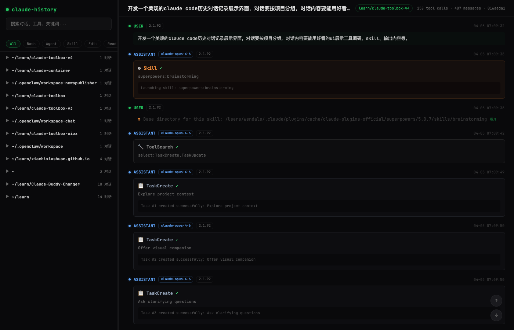

<div align="center">

# 🖥️ Claude History Viewer

### ✨ A beautiful dark-themed conversation history viewer for Claude Code ✨

[](https://react.dev)
[](https://tailwindcss.com)
[](https://bun.sh)
[](https://hono.dev)
[](LICENSE)

**🔍 Visualize tool calls · 📊 Browse by project · 🎯 Search & filter · 🌙 Terminal dark theme**

[English](#-features) · [中文文档](README.zh-CN.md)

</div>

---



## 🚀 Quick Start

> **Prerequisites:** [Bun](https://bun.sh/) + [Claude Code](https://docs.anthropic.com/en/docs/claude-code) with conversation history in `~/.claude/`

```bash
git clone https://github.com/xiachixiashuan/claude-history-viewer.git
cd claude-history-viewer
bun install
bun run dev
```

🌐 Open **http://localhost:5173** in your browser.

## 🎨 Features

### 🔧 Tool Call Visualization

Each tool type gets its own **color-coded glassmorphic card** with detailed input/output:

| Tool | Color | Icon | Display |
|:-----|:------|:-----|:--------|
| **Bash** | 🟢 Green | ⚡ | Command + output, red border on error |
| **Agent** | 🟣 Purple | ⬡ | Description + model badge + sub-op stats |
| **Read** | 🔵 Blue | 📖 | File path + line range + content preview |
| **Grep** | 🟡 Yellow | 🔍 | Pattern + match count + results |
| **Edit** | 🩷 Pink | ✏️ | File path + diff view (🔴 deleted / 🟢 added) |
| **Write** | 🩵 Cyan | 📝 | File path (new file indicator) |
| **Skill** | 🟠 Orange | ⚙ | Skill name (collapsible content) |
| **Task** | ⚪ Gray | 📋 | Task subject / status change |

### 📂 Project-Grouped Sidebar

- 🗂️ **Collapsible groups** — Sessions organized by project, click to expand/collapse
- 🏷️ **Session cards** — Title, timestamp, tool count, colored tool-type dots
- 🔍 **Search** — Full-text search across conversations (debounced)
- 🏷️ **Filter chips** — Quick filter by tool type (Bash, Agent, Skill, Edit...)
- ↔️ **Resizable** — Drag the edge to adjust width (240px – 600px)

### 💬 Message Flow

- 🟢 **USER** / 🔵 **ASSISTANT** / 🟡 **SYSTEM** — Color-coded role indicators
- 🤖 **Model badge** — Shows `claude-opus-4-6`, `claude-sonnet-4-5`, etc.
- 📅 **Date + time** — Full `MM-DD HH:MM:SS` timestamp on every message
- 🏷️ **Version badge** — Claude Code version (e.g. `2.1.92`)

### 🧹 Smart Content Handling

- 📝 **Markdown rendering** — Headings, bold, code blocks, lists in assistant messages
- 🔇 **XML tag cleaning** — `<system-reminder>`, `<command-message>` etc. auto-stripped
- 📦 **Skill collapse** — Long skill injections collapsed to one line with ⚙ icon
- 📏 **Long text collapse** — Expand/collapse for long messages and tool results
- 🎨 **Diff highlighting** — Edit results with red/green line coloring
- 👻 **Empty filtering** — Messages empty after cleaning are hidden

### 🧭 Navigation

- ⬆️⬇️ **Scroll buttons** — Floating top/bottom buttons
- 🔄 **Refresh** — Reload current session to see new messages
- 🎯 **Auto-select** — Latest session selected on load

## 🛠️ Tech Stack

| Layer | Technology |
|:------|:-----------|
| ⚛️ Frontend | React 19 + Tailwind CSS v4 + Vite 8 |
| 🔥 Backend | Hono + Bun |
| 🔤 Fonts | JetBrains Mono (code) + Inter (UI) |
| 🎨 Theme | Terminal dark (`#09090b`) + green accent (`#22c55e`) + glassmorphism |

## 📜 Scripts

| Command | Description |
|:--------|:------------|
| `bun run dev` | 🚀 Start backend (3456) + frontend (5173) |
| `bun run dev:server` | 🔧 Backend only |
| `bun run dev:client` | 🎨 Frontend only |
| `bun run build` | 📦 Production build |

## 📁 Data Source

The viewer reads Claude Code's **local data files** (read-only, never modifies):

```
~/.claude/
├── history.jsonl                    # 📋 Session index
└── projects/
    └── <encoded-project-path>/
        ├── <sessionId>.jsonl        # 💬 Conversation transcript
        └── <sessionId>/
            └── subagents/           # 🤖 Sub-agent transcripts
```

## 🔌 API

| Endpoint | Description |
|:---------|:------------|
| `GET /api/projects` | 📂 List projects with session counts |
| `GET /api/sessions?project=&tool=&q=` | 🔍 List sessions with filters |
| `GET /api/sessions/:id` | 💬 Full session messages + summary |

## 📄 License

MIT

---

<div align="center">

**Built with 💚 by Claude Code**

</div>
